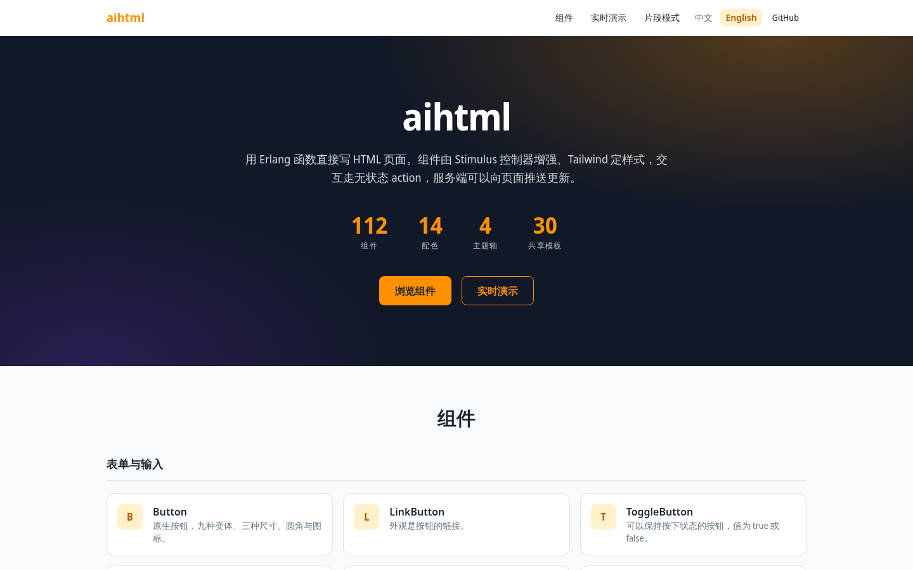
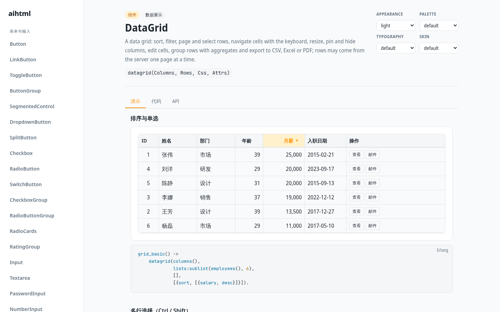
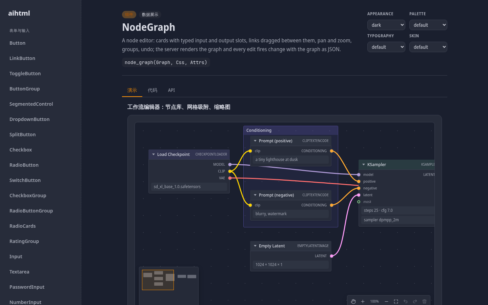
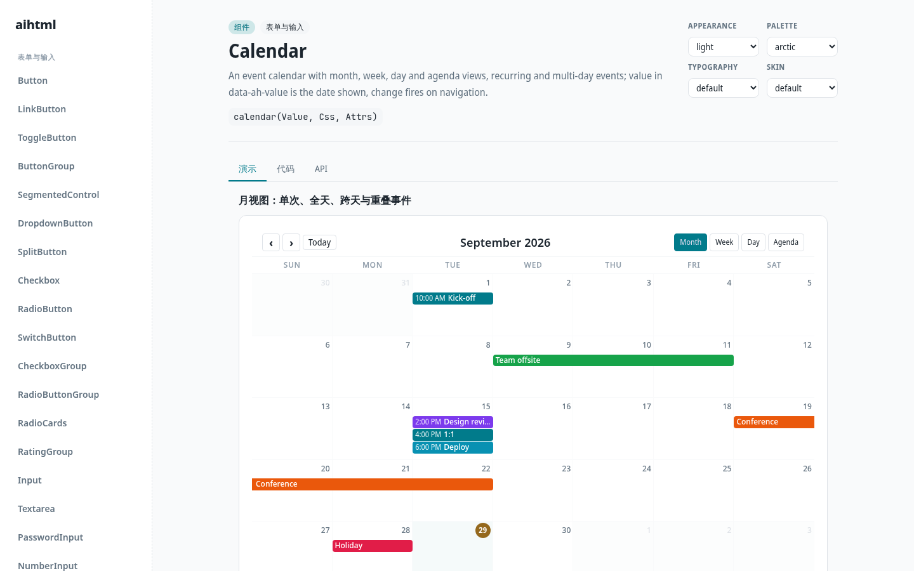
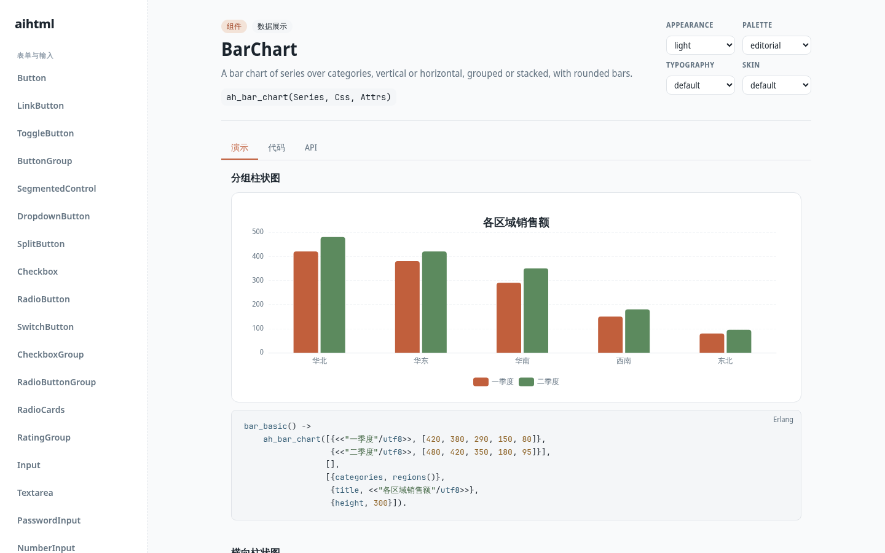
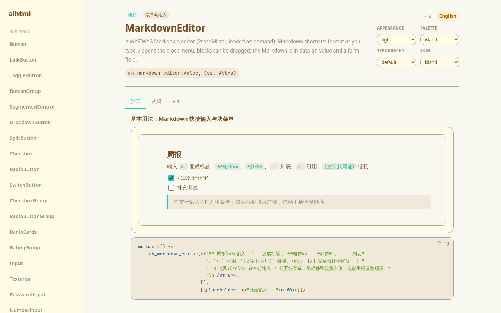
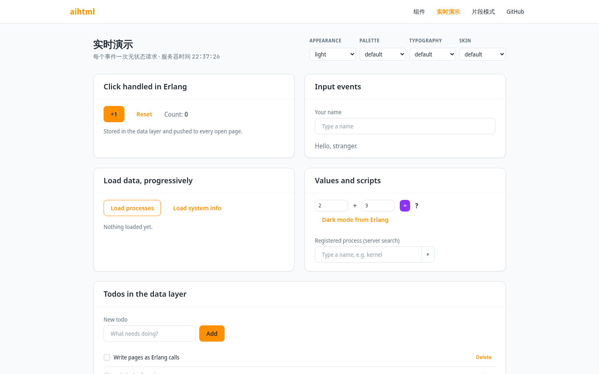

# aihtml

English | [简体中文](README.md)

Write HTML pages directly with Erlang functions. Pages are assembled from prefabs; the server outputs complete static HTML, the browser side is enhanced by Stimulus controllers, and the styling uses TailwindCSS.



Button clicks are handled directly by Erlang functions. Each event is one stateless request, and the response is the DOM operation to apply:

```erlang
ah_button(<<"Delete">>, Id, [borderless], [on(click, {?MODULE, delete, #{id => Id}})])

%% Record form of the same button; postback defaults to the current module
#ah_button{body = <<"Delete">>, variant = borderless, postback = {delete, #{id => Id}}}

action(delete, #{id := Id}, _Event, Ctx) ->
    ok = todo_db:delete(Id),
    aihtml_action:remove(Ctx, {id, [<<"todo-">>, integer_to_binary(Id)]}).
```

```erlang
-include_lib("aihtml/include/aihtml.hrl").

login() ->
    ah_div([ah_checkbox(<<"Remember me">>, yes, [], [{name, remember}]),
            ah_button(<<"Save">>, save, [primary, <<"mt-4">>], [{type, submit}])],
           [<<"flex flex-col gap-2">>], [{id, login}]).

%% aihtml:render(login()) -> iodata()
```

- Rendering relies on [beamai_render](https://github.com/TTalkPro/beamai_render): escaping uses `beamai_html_escape`; `{safe, iodata()}` matches beamai_jinja's safety marker, so the rendered output can be placed directly into Jinja templates.
- Frontend foundation: Stimulus 3 and Tailwind CSS v4. Browser-side code is strictly typed TypeScript, bundled with Vite (see `designs/06-bundling.md`). Component behavior is implemented as Stimulus controller classes written against the native DOM; the library does not depend on jQuery. OTP 27 or above is required because the built-in `json` module is used.
- Components and themes are ported from [sigil](../sigil) (MIT): 111 components, plus the server-rendered markdown_view, 112 in total; together with the four-axis theme (appearance, palette, typography, skin).

## Screenshots

The screenshots below all come from the demo site in the repo (open http://localhost:8080/ after `rebar3 shell`) and are generated by `npm run screenshots`. On each component doc page, the top shows the rendered result and the bottom shows the Erlang code that produces it; the four dropdowns in the top-right switch the appearance, palette, typography, and skin theme axes. The images below use different combinations.

<table>
  <tr>
    <td width="50%"><br><b>DataGrid</b>: sorting, filtering, pagination, editing, export; the first page of remote mode is rendered server-side</td>
    <td width="50%"><br><b>NodeGraph</b>: node editor with connections, grouping, undo/redo (dark appearance)</td>
  </tr>
  <tr>
    <td><br><b>Calendar</b>: month, week, day, and agenda views, draggable (arctic palette)</td>
    <td><br><b>BarChart</b>: echarts loaded on demand, colors drawn from the theme (editorial palette)</td>
  </tr>
  <tr>
    <td><br><b>MarkdownEditor</b>: ProseMirror WYSIWYG (island palette and skin)</td>
    <td><br><b>Live demo</b>: clicks are handled by Erlang; counts and todos live in the data layer and are pushed to every open page</td>
  </tr>
</table>

## Repository Layout

| Path | Contents |
|---|---|
| `apps/aihtml` | The library itself; other projects only depend on it |
| `apps/aihtml/src` | Core modules (`aihtml`, `aihtml_html`, `aihtml_action`...), one module per component `aihtml_<component-name>`, plus the shared `aihtml_lib_*` |
| `apps/aihtml/include` | `aihtml.hrl` (imports all builder functions and records), one record header per component `aihtml_<component-name>.hrl`, and `aihtml_element.hrl` for custom components |
| `apps/aihtml/priv/css/aihtml.css` | Source styles: tokens, the four axes, and prefabs; consumed by the consumer's Tailwind build |
| `apps/aihtml/priv/i18n` | Text catalogs: one JSON file per language (`en.json`, `zh.json`); see "Internationalization" |
| `apps/aihtml/priv/static` | Prebuilt artifacts (only these are shipped): `css/` (`aihtml-<hash>.css` + `manifest.json`), `js/` (the Vite-bundled runtime: entry point + one chunk per component + `manifest.json`). echarts, xlsx, and jspdf are on-demand-loading chunks; ProseMirror lives in the markdown_editor chunk (see "Third-party libraries") |
| `apps/aihtml_cowboy` | cowboy integration: action endpoint, static-asset routing, whole-page replies |
| `apps/aihtml/templates` | Shared Mustache templates, compiled to both Erlang and JS at build time |
| `apps/aihtml/assets/js` | Browser-side TypeScript source (not shipped): entry `main.ts`, runtime `core.ts` and `runtime/`, component behaviors `components/<component-name>.ts` (controller classes, shared parts in `_lib_*.ts`), bundled by Vite (`vite.config.mjs`) into `priv/static/js`; `npm run typecheck` runs the type check |
| `apps/aihtml_example` | cowboy demo site: `/` home page, `/components/:name` component doc (demos, code, API), `/demo` live demo, `/fetch` URL fragment mode. Component examples `aihtml_example_demo_*` live here too, not in the library |
| `scripts/` | Build and test scripts: style porting, JS build, stylesheet hashing (`hash-css.mjs`), template compiler, facade generation, preview, screenshots |
| `designs/` | Design documents |
| `docs/screenshots/` | Demo-site screenshots used by the README |

## Calling Conventions

Constructors share names with their records and all carry the `ah_` prefix: `ah_button/4` builds `#ah_button{}`, while plain tags like `ah_div/3` build `#ah_el{}`. Every constructor returns an element record: plain tags return the shared `#ah_el{tag, body}`, and components return their own record (see "the record form" below). The two can nest freely, and `aihtml:render/1` produces the final iodata. Before rendering, elements are ordinary data you can pattern-match and modify; mistakes in attribute names and the like surface at render time.

| Form | Example |
|---|---|
| Generic tag | `ah_p(Children)`, `ah_p(Children, Css, Attrs)`, `ah_div(Children, Css, Attrs)` |
| Void element | `ah_img(Css, Attrs)`, `ah_hr(Css, Attrs)`, `ah_br()` |
| Value component | `ah_button(Content, Value, Css, Attrs)`, `ah_dropdownlist(Items, Value, Css, Attrs)`, `ah_datepicker(Value, Css, Attrs)` |
| Container and display | `ah_card(Children, Css, Attrs)`, `ah_chip(Content, Css, Attrs)`, `ah_loader(Css, Attrs)` |
| Arbitrary tag | `aihtml:ah_el(Tag, Children, Css, Attrs)`, `aihtml:ah_void(Tag, Css, Attrs)` |
| The record form | `#ah_el{tag = section, body = Children, css = Css, attrs = Attrs, id = x}`; the `body` of a void element may be omitted |

**Children**: binaries, numbers, atoms, and printable strings are output as escaped text; any other list is a sequence of child nodes; `safe(IoData)` is emitted verbatim.

**Css**: an atom is a semantic modifier of a prefab, validated by `aihtml_catalog`; unknown or conflicting modifiers raise an error immediately. A binary is a literal class, usually a Tailwind utility class, and comes after the semantic classes.

**Attrs**: a proplist or map, and lists may be nested. `true` outputs a boolean attribute; `false` and `undefined` are omitted. `aria_label` becomes `aria-label`, and `{data, #{k => v}}` expands to `data-k`. Later attributes with the same name overwrite earlier ones, while `class` is accumulated. For components that wrap a native control (checkbox, radio, switch, input, textarea, select, etc.), `id`, `Attrs`, and `postback` apply to the inner native control, not to the outer container; see the note above the record on each component's API page for details.

The list of prefabs, modifiers, options, events, and methods lives in `aihtml_catalog:prefabs/0`. The demo site's `/components/:name` provides a doc page for each component, styled after sigil, with three tabs:
- **Demo**: a live example, with the Erlang function that renders it shown below.
- **Code**: every example function for the component.
- **API**: signatures, record fields, modifiers, options, events, methods, CSS class names.

Examples live in `apps/aihtml_example/src/aihtml_example_demo_<component-name>.erl`; the conventions are in `designs/04-components.md`.

### The record form

Each component has a record with the `ah_` prefix; functions like `ah_button/4` are just shorthand for building it. After a page module includes `aihtml.hrl`, both forms can be mixed:

```erlang
-include_lib("aihtml/include/aihtml.hrl").

%% Function form
ah_button(<<"Save">>, save, [success, lg], [{disabled, true}])

%% Record form: the same element
#ah_button{body = <<"Save">>, value = save, variant = success, size = lg,
           disabled = true}
```

The record form suits components with many options, and makes it easy to inspect and modify elements before rendering:

- **Field names are checked at compile time**: `#ah_datepicker{fisrt_day = 1}` fails to compile. In the function form, a misspelled option is emitted as an HTML attribute without any error.
- **Modifiers are typed fields**: modifier groups (variant, size, ...) and flags (round, disabled, ...) are fields of the same name, so dialyzer catches `variant = primery`, and the values are also validated at render time.
- **Omitted fields take the default**, which matches the function form.

Every record starts with the same set of common fields:

| Field | Description |
|---|---|
| `id` | id of the root element |
| `css` | literal class names (binary), usually Tailwind classes; modifiers go in their own fields, not here |
| `attrs` | HTML attributes, written the same way as `Attrs` in the function form; can hold the results of `on/3` and `fetch/3` |
| `postback` | `Action`, `{Action, Args}`, or `{Action, Args, OnOpts}`; bound to the component's primary event |
| `delegate` | module that handles the postback action; defaults to the module that wrote the record |
| `module` | module responsible for rendering; defaults to the component's own module, e.g. `aihtml_button` |

`postback` is shorthand for `on/3`. The following two forms are equivalent:

```erlang
#ah_button{body = <<"Save">>, postback = {save, #{id => Id}}}
ah_button(<<"Save">>, undefined, [], [on(click, {?MODULE, save, #{id => Id}})])
```

The primary event is chosen by the component: `click` for buttons, `change` for value controls, `'ah:close'` for drawer, window, and the like. Components with no primary event (card, badge, ...) raise `no_postback_event` if `postback` is set. See the API tab on the demo site for each component's fields, types, defaults, and primary event.

**Custom components**: consumer libraries can define components the same way without registration. Records start with `?AH_BASE(render_module)`, and the render module implements the `aihtml_element` behaviour:

```erlang
-include_lib("aihtml/include/aihtml_element.hrl").
-record(myapp_card, {?AH_BASE(myapp_card), title, body = []}).

-behaviour(aihtml_element).
render(#myapp_card{title = T, body = B} = R) ->
    aihtml:ah_div([aihtml:ah_h3(T), B], [<<"card">> | R#myapp_card.css],
                  aihtml_element:root_attrs(R, click)).
```

Changing `module` to another module swaps the render path for a single element, e.g. `#ah_button{module = myapp_fancy_button}`.

**Notes**:
- The header file defines the record's tuple layout; after a component gains or loses fields, consumers must recompile.
- Errors in field values surface at render time; a wrong modifier name is reported when the function is called, and a wrong field name is reported at compile time.
- In the function form, atom keys in `Attrs` that share a name with a field (e.g. `{disabled, true}`, `{name, x}`) populate that field; `postback`, `delegate`, and `module` can only be set in the record.

Design details in `designs/05-records.md`.

## Components

111 components were ported from sigil, plus aihtml's own `markdown_view` for a total of 112. Each component is one module `aihtml_<component-name>`. See `designs/04-components.md` for file organization and conventions. Categorized by purpose:

| Category | Components |
|---|---|
| Buttons | button, button_group, link_button, toggle_button, dropdown_button, split_button, segmented_control |
| Selection | checkbox, checkbox_group, radiobutton, radiobutton_group, radio_cards, switch_button, rating_group |
| Text input | input, textarea, password_input, number_input, input_otp, tag_input, markdown_editor (WYSIWYG, based on ProseMirror), markdown_view (server-side Markdown to HTML rendering) |
| Selection and forms | dropdownlist, select, slider, field, form_layout; use `validate/1` for validation |
| Pickers | datepicker, combobox (server-side search supported), timepicker, colorpicker |
| Basic layout | card, panel, expander, tabs, tab_bar, breadcrumbs, pagination, steps, skeleton, loader, empty |
| Navigation | menu, navbar, sidenav, toolbar, splitter, listmenu, status_bar |
| Overlays | tooltip, popover, drawer, sheet, window, notification; triggers like `ah_toast/3`, `opens/1` |
| Display | avatar, badge, chip, aspect_ratio, kbd, time_ago, expandable_text, progressbar, progress_circle, meter, statistic, kpi_card, timeline, ranking_list, tag_cloud, alert |
| Calendar | calendar (event calendar: month, week, day, schedule views, draggable), datetime_input |
| List selection | cascader (next level can be lazy-loaded from the server), listbox (server-side search supported), transfer |
| Entry | masked_input, formatted_input (radix input), range_selector, repeat_button |
| Upload | upload (XHR upload to a specified URL, with progress; falls back to native form submission when no URL is given) |
| Trees and data | parent (children can be lazy-loaded from the server), nav_tree, diff (Erlang-computed difference), heatmap_calendar |
| Scrolling and responsive | scrollview (paging carousel), scrollbar, responsive_panel |
| Toolbars and commands | activity_bar, navigationbar, command (command palette, server-side search supported) |
| Drag and drop | sortable, dragdrop |
| Data grid | datagrid (sorting, filtering, paging, grouping, editing, frozen columns, export) |
| Pivot grid | pivotgrid (Erlang-side aggregation, drag fields to re-pivot, export to Excel) |
| Tables | treegrid (children can be lazy-loaded), datatable (row detail, advanced filtering, editing) |
| Scheduling | gantt, scheduler (day, week, month, timeline, schedule views, columns per resource), swimlane (cross-functional flow diagram) |
| Charts | chart (any echarts config), area_chart, bar_chart, donut_chart, radar_chart, relation_graph |
| Node graph | node_graph (node editor: connections, grouping, undo/redo, Erlang-side auto layout) |
| Docking layout | docking, dock_layout (IDE-style panes, tab groups, floating, auto-hide) |
| Ribbon and panes | ribbon, tile_layout (pane layout with draggable splitters and tab groups) |

- **Value components**: a custom control writes its current value to the root element's `data-ah-value`, participates in forms through a hidden input, and fires `change` on the root element when the value changes. So `on(change, {M, A, Args})` placed in the component's Attrs receives the event, and `Event.value` is that value.
- **Multiple values** (multi-select combobox, listbox, transfer, checkbox_group, the selected rows of a datagrid, the order of a sortable, etc.) are joined with commas; commas and backslashes within a value are written as `\,` and `\\`. On the server, split with `aihtml_value:split(Event.value)` and join with `aihtml_value:join(List)`; the browser side has the matching `AH.lib.values.split/join`. Values without commas are written the same way as before.
- **Server-driven**: in an action, call component methods with `aihtml_action:call(Ctx, Target, Method, Args)` to, for example, open a drawer or set progress. Wrappers like `aihtml_toast:ah_toast(Ctx, Msg, Opts)` and `aihtml_lib_overlay:open(Ctx, Target)` are also available.
- **Helper functions**: functions outside the components are also exported by the `aihtml` facade, so once `aihtml.hrl` is included they can be called directly. The first few are used inside actions: components that need the server to supply data have their actions respond by calling them. They render HTML on the server and morph-swap it into the component; the browser does not assemble HTML. The latter ones generate attributes to be merged into an element's Attrs:

  | Function | Purpose |
  |---|---|
  | `set_items/3,4` | combobox's `search` option: backfill search results |
  | `listbox_items/3,4` | listbox's `search` option: backfill search results |
  | `cascader_children/3,4` | cascader's `load` option: backfill the lazy-loaded next level |
  | `set_children/3` | tree's `load` option: backfill lazy-loaded children |
  | `set_command_items/3` | command's `search` option: backfill the command list |
  | `set_events/3`, `add_event/3` | calendar: backfill or append events for the current visible range |
  | `uploaded_files/1` | upload's `change` event: decode the uploaded file list |
  | `validate/1` | browser-side form-validation attributes to merge into a control's Attrs, e.g. `validate([required, email])`; the form will not submit when validation fails |
  | `tooltip_attrs/2`, `opens/1`, `closes/0,1,2`, `toggles/1`, `shows_toast/2` | overlay trigger attributes, merge into any element's Attrs |
  | `draggable_attrs/2`, `drop_zone_attrs/2` | dragdrop draggable element and drop zone attributes |
  | `datagrid_query/1`, `datagrid_rows/4`, `datagrid_row/3`, `datagrid_select/2` | datagrid remote mode: read the query, backfill one page, redraw one row, run a query against in-memory data |
  | `datatable_query/1`, `datatable_rows/3`, `datatable_row/4`, `treegrid_children/3` | datatable remote mode and edit responses; treegrid lazy loading |
  | `pivotgrid_view/1`, `pivotgrid_rows/3`, `pivotgrid_cell/1` | pivotgrid remote mode and cell click |
  | `scheduler_range/1`, `scheduler_update/3`, `gantt_update/3`, `swimlane_update/3` | scheduler switches date range; the latter three redraw after edits |
  | `chart_update/3`, `chart_option/1` | update an existing chart's data or config without re-rendering |
  | `set_node_graph/3`, `node_graph_layout/1` | replace the node graph; auto layout on the server |
  | `docking_add_window/4`, `dock_layout_open/3,4` | add a window to the docking layout, open a panel |

  ```erlang
  %% Load children when a node in the tree expands: ah_tree(Items, undefined, [], [{load, {?MODULE, children, #{}}}])
  %% The expanded node's value is in Event.data (the node's data-value attribute)
  action(children, _Args, #{data := #{<<"value">> := Parent}} = Event, Ctx) ->
      set_children(Ctx, Event, [{C, C} || C <- db:children(Parent)]).
  ```
- **Large-data components** (datagrid, datatable, pivotgrid, scheduler, etc.) support two modes. The server does not keep view state in either:
  - **Local mode**: the server renders all data in one pass; sorting, filtering, paging, and grouping happen in the browser.
  - **Remote mode**: provide the `source` option (an action). Every view change (sorting, filtering, paging, date-range switch) fires that action with the query in the `Event`; the action responds with the helpers in the table above, the server renders a new page, and it is morph-swapped into the page.
  - Layout components (dock_layout, tile_layout, node_graph) write the user-adjusted layout as JSON in `data-ah-value` and fire `change`. Once persisted on the server, the next render uses that JSON to produce the same layout.

  ```erlang
  ah_datagrid(Columns, FirstPage, [pageable], [{source, {?MODULE, orders, #{}}}, {total, Total}])

  action(orders, _Args, Event, Ctx) ->
      #{offset := Off, limit := Lim, sort := Sort, filters := F} = datagrid_query(Event),
      {Rows, Total} = orders_db:page(Off, Lim, Sort, F),
      datagrid_rows(Ctx, Event, Rows, Total).
  ```
- **Styles**: sigil's styles are imported by `scripts/port-sigil.mjs` into `priv/css/sigil`, with the prefix changed from `sigil-` to `ah-`, and the MIT notice preserved.
- **Facade**: the `aihtml` component functions, the includes in `aihtml.hrl`, and `aihtml_records.hrl` are generated from each component module by `scripts/gen-facade.escript`, including the build functions and the helper functions listed by each module's `facade_extras/0`. When adding a component, add its module to `?COMPONENTS` in `aihtml_catalog`, then run `rebar3 compile && escript scripts/gen-facade.escript`.

## Interaction Model

The server renders all HTML, and pages are produced by ordinary HTTP handlers. The browser side has two interaction modes, both stateless.

### action mode

Each event issues a POST, and the response is the DOM operations to apply. The server keeps nothing between requests; all state lives in the data layer. Requests can land on any node, the load balancer doesn't need stickiness, and pages that are already open keep working after a server restart.

- **Binding**: `on(Event, {Module, Action, Args})`, with optional `#{debounce => Ms, include => [Selector], confirm => Prompt}`, plus the `sync`, `sync_scope`, `indicator`, `disable` options from the "Request coordination and loading indicators" section below.
- **Signature**: `{Module, Action, Args}` is HMAC-signed with the application secret and written into the HTML. The browser cannot forge actions or tamper with arguments. Args are signed but not encrypted, so the page can read them; put only ids and similar data in there.
- **Execution**: `Module:action(Action, Args, Event, Ctx)` runs in the request process. Only modules that declare `-behaviour(aihtml_action)` can be called.
- **Event**: includes the element's `id`, `value`, `checked`, `key`, the whole containing form's fields in `form`, the values of other controls named by `include` in `values`, and `data-*` attributes in `data`.
- **Page operations**: `aihtml_action:html/3,4`, `remove/2`, `attr/4`, `add_class/3`, `remove_class/3`, `set_value/3`, `focus/2`, `title/2`, `redirect/2`, `js/2`, `call/4`, `trigger/4`, `push_url/2`, `replace_url/2`. Operations are buffered and sent together when the action returns. `flush/1` sends them early, useful for showing a loading state before the data arrives.
- **Response**: normally `application/json` with `{"ops": [Operations...]}`. Actions that called `flush/1` return `application/x-ndjson`, one `{"ops": [...]}` line per flush, with a final `{"done": true}` line. Errors use HTTP status plus `{"error": Code}`: 403 `invalid_action`, 400 `bad_request`, 500 `action_failed` (action crashed, logged only, no details leaked to the browser). The browser fires `ah:error` on the element, with detail `{status, error}`. The format is described in `designs/02-actions.md`; it is not an AG-UI event stream, and the relationship to AG-UI is documented there.
- **Concurrency**: repeated clicks and submits on the same element are ignored while a request is in flight. Events such as `input` and `change` follow the latest value and cancel older requests.
- **Authorization**: authentication and authorization happen inside the action; the request is reachable via `aihtml_action:meta(Ctx)`, which under cowboy is `#{req => Req}`.

```erlang
-module(todo_page).
-behaviour(aihtml_action).
-include_lib("aihtml/include/aihtml.hrl").
-export([init/2, action/4]).

init(Req, State) ->                       %% GET /, ordinary cowboy handler
    {ok, aihtml_cowboy:reply(Req, view(todo_db:all()), #{title => <<"Todos">>}), State}.

action(toggle, #{id := Id}, #{checked := Done}, Ctx) ->
    ok = todo_db:set_done(Id, Done),
    aihtml_action:html(Ctx, {id, dom_id(Id)}, item(todo_db:get(Id)), outer).
```

**Secret**: configure `secret` in the aihtml application environment, at least 32 bytes, identical on every node:

```erlang
%% sys.config
[{aihtml, [{secret, <<"...a random value of at least 32 bytes...">>}]}].
```

When unconfigured, every node generates a random secret, which is only suitable for development: after a restart or moving to another node, actions on already-open pages are rejected with 403.

### Server push

Pages subscribe to topics; the server pushes the same DOM operations as actions to subscribers. Push does not require business state either:

```erlang
%% Page: this list follows the todos topic; run refresh to catch up after reconnect
ah_ul(Items, [], [{id, todo_list},
                  subscribe(todos, #{refresh => {?MODULE, refresh_todos, #{}}})])

%% Any node, any process, typically right after the action has written the data layer
aihtml_push:publish(todos, fun(C) ->
    aihtml_action:html(C, {id, todo_list}, item(Todo), append)
end, #{except => Ctx})     %% skip the originator, it has already updated via the action response
```

- **Pushing data**: push can do every operation an action can. `aihtml_push:call(Topic, Target, Method, Args)` calls a component method (for example `setData` on a chart); `aihtml_push:trigger(Topic, Target, Event, Detail)` fires a DOM event with data. Both have a 5-argument form that takes `#{except => Ctx}`.
- **One stream**: each page opens a single EventSource, hitting `GET /aihtml/events?t=...` with signed tokens for every topic on the page. The stream is SSE named events: first a `hello` (stream id), then one `ops` (operations list) per push. When the page's subscription set changes, the page POSTs the new topic set to the same path; the stream process joins and leaves topics in place without breaking the connection.
- **Slow clients**: streams where the reader falls behind by more than 1000 buffered operations are closed by the server; the browser reconnects and `refresh` catches up.
- **Cross-node distribution**: connection processes join an OTP `pg` process group and only forward, holding no business state. `pg` spans every connected node: publish from any node and every subscriber in the cluster receives it.
- **At-most-once delivery**: pushes sent while a client is disconnected are lost. EventSource reconnects automatically, then runs the subscription's `refresh` action to catch up from the data layer.
- **Topics** can be any plain term, for example `todos` or `{room, 42}`. Topics are also signed; a page can only subscribe to topics the server rendered for it, so deciding per user which topics to render gives authorization. Topic names are visible to the page.
- **The aihtml application must be running**, since it starts the `pg` scope. Add `aihtml` to your application's `applications` list.

### fetch mode

Attributes produced by `fetch/3,4` make an element request a URL that you route yourself; the returned HTML fragment replaces the target location. Fits scenarios with REST routes you already have:

```erlang
ah_button(<<"More">>, more, [outlined],
          [fetch(get, <<"/items?page=2">>, <<"#items">>, #{swap => append})])
```

### File upload

File content doesn't go through actions: action requests are JSON, which can't carry binary. The upload component has two uses:
- **With `url`**: the browser uses XHR to POST each file to that address (multipart, field name `file` by default) and shows progress. The JSON returned by the server becomes the component's value; once upload finishes, the root element fires `change`, so a postback in an ordinary action can pick up the file list:

  ```erlang
  ah_upload([], [], [{url, <<"/upload">>}, {name, files},
                     on(change, {?MODULE, uploaded, #{}})])

  action(uploaded, _Args, Event, Ctx) ->
      Files = uploaded_files(Event),        %% [#{<<"name">> => ..., <<"size">> => ...}]
      ...
  ```

  The receiving endpoint is routed and implemented by your application; see the demo site's `aihtml_example_upload` (cowboy's `read_part` reads multipart).
- **Without `url`**: the component is a styled `<input type="file">`; the files are submitted as native multipart along with the surrounding form.

### Prefab behaviour

Root elements carrying `data-ah="<name>"` are enhanced by the Stimulus controller of the same name, for example tabs switching or alert closing.

- **On-demand loading**: the page only loads the runtime entry (about 23 KB after gzip). A component's code chunk is fetched the first time it appears on the page; the same happens for components the server inserts later. Stimulus connects them automatically, no manual mounting required.
- **Page inclusion**: `aihtml_page` reads the bundle's `manifest.json` and writes out `<script type="module" src="/aihtml/js/main-<hash>.js">`; the stylesheet likewise comes from `css/manifest.json` as `<link href="/aihtml/css/aihtml-<hash>.css">`. When static assets aren't mounted at `/aihtml/`, use the `assets` option to specify the path, and both the script and the stylesheet follow; page scripts listed in the `js` option get `defer` added and run in order after the runtime.
- **Global variable**: the runtime lives on `window.AH`. aihtml does not ship jQuery; when a page's own scripts need it, supply the file yourself and include it with the `js` option (`js => [<<"/static/jquery.min.js">>, <<"/static/app.js">>]`, executed in order).
- **Events are native**: both components and the runtime dispatch bubbling native events (`change`, `ah:close`, `ah:theme`, and so on), with the accompanying data in `e.detail`. Page scripts listen with `addEventListener`; when listening through jQuery, read the data from `e.originalEvent.detail`, not the handler's second argument. The `Detail` of server-side `aihtml_action:trigger/4` likewise becomes `e.detail`.

### Swap modes and morphing

The `swap` option in `aihtml_action:html(Ctx, Target, Html, Swap)`, server-side push, and `fetch/4` all use the same set of swap modes:

| Swap | Effect |
|---|---|
| `inner` (default) | Replace the target's contents |
| `outer` | Replace the target element itself |
| `append` / `prepend` | Append to the end or the start of the contents |
| `morph` | Morph the target element itself into the new HTML; the new HTML must have exactly one root element |
| `morph_inner` | Morph the target's contents into the new HTML |
| `none` | Leave the page unchanged |

**Morphing** does not tear down the old nodes; it brings the existing DOM toward the new HTML:
- **Node matching**: child nodes are matched by id first, and fall back to position and tag when no id is present; attributes are synced one by one.
- **State preservation**: nodes that remain are left as they are, so focus, caret, scroll position, open overlays, and component state are unaffected.
- **Form controls**: controls without focus take the server's new values; a focused control keeps whatever the user is typing.
- **Components**: a component whose internals changed is reinitialized only once, at the outermost level; newly added nodes have their behavior mounted, and removed nodes are torn down first.

**Focus preservation** applies to every swap mode: the focused element's id and selection range are recorded before the swap, then looked up by id and restored afterwards. Elements that need to keep focus must therefore carry a stable id.

A typical usage is to have the server re-render a whole region and morph it back in place. For example, a list with a search box where the user keeps typing while it refreshes: the input keeps its focus and caret.

```erlang
%% Page: search box and results live in one block, all with stable ids
results(Query, Rows) ->
    ah_div([ah_input(Query, [], [{id, q}, {name, q},
                                 on(input, {?MODULE, search, #{}}, #{debounce => 200})]),
            ah_ul([ah_li(R) || R <- Rows], [], [{id, rows}])],
           [], [{id, search_box}]).

action(search, _, #{value := Q}, Ctx) ->
    aihtml_action:html(Ctx, {id, search_box}, results(Q, db:search(Q)), morph).
```

The browser can call it directly too: `AH.swap($("#box"), Html, "morph")`.

### Element preservation

An element carrying `preserve()` (i.e. `data-ah-preserve`) and an id is never replaced under any swap mode. When the new content contains an element with the same id, the one already on the page is moved as-is to the new location and the incoming copy is discarded.

Use it for: a video that is playing, an editor with unsaved content, a component already mounted with internal state. When the browser supports `moveBefore`, that is used to move the node, so iframes and media do not reload.

```erlang
ah_div([video_player(Url), comments(Items)], [], [{id, player_box}])
%% The player itself:
ah_div(Player, [], [{id, player}, preserve()])
```

### Settle transitions

After a normal swap (`inner`, `outer`, `append`, `prepend`) there is a 20 millisecond settle period:
- **New top-level elements** carry the `ah-added` class, and the swap target carries the `ah-settling` class; both are removed when the settle period ends.
- **Elements sharing an id with the previous element** initially keep the old element's `class`, `style`, `width`, and `height`, and only switch to the new values once the settle period ends. So style changes between two renders become CSS transitions.
- Morphing already mutates attributes on the existing nodes, so transitions apply naturally. Nodes added by morphing carry `ah-added` as well.
- Component root elements (`data-ah`) do not participate; their behavior needs to read the real attributes at initialization time.

```css
.ah-added { opacity: 0; }
#status { transition: color 300ms, background-color 300ms; }
```

### Request coordination and loading indicators

These `on/3` options are written as element attributes and apply to every action bound to that element:

| Option | Effect |
|---|---|
| `sync => drop` | Ignore new requests while a previous request on the same element is in flight. This is the default for click and submit. |
| `sync => replace` | Abort the in-flight request and send a new one. This is the default for input, change, and keyboard events. |
| `sync => queue` | Wait for the in-flight request to finish before sending. At most one is queued, and only the most recent one is kept. |
| `sync_scope => Selector` | Coordinate per closest matching ancestor; for example `<<"form">>` makes the whole form share one queue. |
| `indicator => Selector` | Add the `ah-request` class to matching elements while the request is in flight. Elements carrying the `ah-indicator` class are only visible during that window. |
| `disable => Selector` | Disable matching elements while the request is in flight; elements that were already disabled stay disabled. |

Selectors can be written as `this` or `<<"closest selector">>`. When several requests share an indicator at once, it stays visible until all of them finish. `fetch/4` also supports `indicator` and `disable`.

Component events (those starting with `ah:`, such as datagrid's `ah:edit` or scheduler's `ah:event-change`) default to `drop`: while a previous request has not finished, new ones are discarded. When users may edit in quick succession, bind these events with `sync => queue`, for example `on('ah:edit', {?MODULE, save_cell, #{}}, #{sync => queue})`.

```erlang
ah_button(<<"Save">>, save, [],
          [on(click, {?MODULE, save, #{}},
              #{indicator => <<"#saving">>, disable => <<"closest form">>})]),
ah_span(<<"Saving…"/utf8>>, [<<"ah-indicator">>], [{id, saving}])
```

### Triggered events and browser history

- **Triggered events**: `aihtml_action:trigger(Ctx, Target | document, Event, Detail)` fires a bubbling DOM event in the browser, with `Detail` passed across as JSON. Page scripts can listen for it, and elements can wire it into another action with `on('ah:saved', ...)`.
- **Browser history**: `aihtml_action:push_url(Ctx, Url)` and `replace_url(Ctx, Url)` write to browser history without making a request, so the address bar and bookmarks match what is currently displayed. When the user moves forward or back to those entries, the page reloads that URL and the server renders it directly. The page is still stateless, as long as those URLs render the matching content.

```erlang
action(page, #{n := N}, _Ev, Ctx) ->
    aihtml_action:html(Ctx, {id, list}, list_page(N), morph),
    aihtml_action:push_url(Ctx, [<<"/items?page=">>, integer_to_binary(N)]).
```

The example site's "Load data" card demonstrates the indicator, disabling, a shared queue, and the history entry for `?view=processes`.

### Floating overlays

Component dropdowns, popups, and floating panels are all positioned by `AH.float(popup, anchor, opts)`. It uses `position: fixed` to stick to the anchor, so containers with `overflow: hidden` such as cards and panels do not clip the overlay; when there is not enough space it flips automatically, and it follows the anchor on scroll and resize. Use it when writing your own overlays too:

```js
var h = AH.float(popup, button, { placement: "bottom", align: "start", matchWidth: true });
// On close
h.stop();
```

## SEO

All page content is emitted by the server, so search engines read it without executing scripts. A few places that would otherwise rely on scripting also have server-side versions:

- **Page metadata**: options of `aihtml_page:render/2` go into `<head>`: `description`, `robots`, `canonical`, `alternates` (`[{Lang, Url}]`, written as hreflang links), `og` (Open Graph, `#{title => ..., image => [...]}`, list values are written multiple times), `meta` (other `<meta name>`, e.g. `twitter:card`), `json_ld` (schema.org structured data, a map or list of maps). Maps are emitted with sorted keys; `<` inside JSON-LD is written as `\u003c`.
  ```erlang
  aihtml_page:render(Body, #{title => <<"Orders"/utf8>>,
                             description => <<"This month's orders at a glance"/utf8>>,
                             canonical => <<"https://example.com/orders">>,
                             og => #{title => <<"Orders"/utf8>>, type => website},
                             json_ld => #{<<"@context">> => <<"https://schema.org">>, <<"@type">> => <<"WebPage">>}})
  ```
- **Markdown**: `ah_markdown_view(Markdown, Css, Attrs)` renders Markdown to HTML on the server (`aihtml_lib_markdown`, ported from markdown-it, same configuration as markdown_editor, byte-identical output to the browser side). It can show user-written Markdown directly: raw HTML is treated as text, and links are restricted to http, https, mailto, and relative addresses.
- **Charts**: every chart emits a visually hidden data table (`<table>`, with a caption and header cells) next to the canvas, and the chart container's role is `figure`. Search engines and screen readers read the data itself.
- **Navigation links**: pagination, datagrid, datatable, calendar, and scheduler have an `href` option (a URL template); the paging, date switching, and view-switching buttons become real `<a href>` links:

  | Component | Template placeholders |
  |---|---|
  | pagination | `{page}`, `{size}` |
  | datagrid, datatable | `{page}`, `{size}`, `{sort}`, `{search}` |
  | calendar, scheduler | `{date}`, `{view}` |

  The page handler reads the state from query parameters and renders the same component, so every state has its own URL: crawlers can follow it, new tabs and refreshes work, and nothing requires scripts. When the component also binds `on(change, Action)`, ordinary clicks are handled in-page (the action uses `html/4` to morph-replace content), the browser pushes the link's URL into history, and forward, back, and refresh all load the corresponding state from the server. The demo site's `/components/:name/state?...` (`aihtml_example_state`) is such a page handler.
- **Datagrid remote mode**: the first page's data rows are always rendered on the server (the rows given in `source` mode are the first page); no request is sent on mount, and only later sorting, filtering, and paging call actions.

## Third-party libraries

Charts, table export, and the Markdown editor use a few large libraries, each packed by Vite into its own chunk that loads only when needed:

| Library | Purpose | Chunk (min / gzip) | License |
|---|---|---|---|
| echarts | chart, all chart types, relation_graph | `vendor-echarts`, 1.1 MB / 360 KB | Apache-2.0 |
| xlsx (SheetJS) | datagrid, pivotgrid Excel export | `vendor-xlsx`, 415 KB / 135 KB | Apache-2.0 |
| jspdf, jspdf-autotable | datagrid PDF export | `vendor-jspdf` 392 KB / 125 KB, `vendor-jspdf-autotable` 29 KB / 9 KB | MIT |
| ProseMirror, markdown-it | markdown_editor | imported directly by `markdown_editor.ts`, lives in the same `markdown_editor` chunk as the component code, 390 KB / 131 KB total | MIT |

- **Location**: the chunks ship alongside the runtime's other chunks in `priv/static/js` (filenames carry a content hash); see `package.json` for versions. Pure Erlang consumers don't need to run npm, and no extra path configuration is needed. jsPDF itself additionally loads html2canvas, canvg, and dompurify on demand (`vendor-html2canvas` and the like), and only when its `html()` is invoked; table export never uses them.
- **License**: license comments aren't kept in the chunks; every build, `vite.config.mjs` generates `priv/static/js/THIRD-PARTY-LICENSES.txt`, listing every bundled npm package (name, version, license, owning chunk, full license text, and NOTICE), including Stimulus from the entry.
- **On-demand loading**: components load libraries with a dynamic `import()` the first time they're needed: charts load echarts on mount, exports load xlsx or jspdf on click. ProseMirror is only used by markdown_editor, which `import`s it directly; it downloads together with the component's chunk when an editor is present. Pages that don't use these components don't download them. Page scripts use `AH.vendor(name)` to obtain the same library, returning a Promise, loaded once per page; passing a list returns the list in order:
  ```js
  AH.vendor("echarts").then(function (echarts) { ... });
  AH.vendor(["jspdf", "jspdf-autotable"]).then(function (libs) { ... });   // [{jsPDF, ...}, autoTable]
  ```
  Available names: `echarts`, `xlsx`, `jspdf`, `jspdf-autotable` (resolved to the `autoTable(doc, options)` function). Libraries no longer appear as global variables (`window.echarts` etc.), and globals of the same name introduced by the page itself aren't used either.
- **Chinese in PDFs**: jsPDF's default fonts don't include Chinese, so Chinese characters don't render in exported PDFs, the same as sigil.

## Shared templates

A small number of HTML fragments must be generated in the browser, such as date grids, client-side toasts, and tags the user has just typed. These fragments are written as a single Mustache template, compiled at build time into both sides, and produce identical output:

- **Erlang side**: compiled into module functions by beamai_render's compile-time transform; data keys are atoms.
- **Browser side**: `scripts/mustache.mjs` compiles the template into `AH.tpl.<name>(data)`, with no runtime dependencies; data keys are strings.

**1. Write the template**: `apps/aihtml/templates/my_badge.mustache`, with a name that starts with the component name.

```mustache
<span class="ah-chip" data-color="{{color}}">{{label}}{{#count}} <b>{{count}}</b>{{/count}}</span>
```

**2. Prepare the fixtures**: `apps/aihtml/templates/my_badge.fixtures.json`, listing a few representative data sets; the test renders them on both sides and compares.

```json
[{"color": "primary", "label": "Inbox", "count": 3},
 {"color": "error", "label": "<b>", "count": 0}]
```

**3. Use on the Erlang side**: declare it in the component module and put it in the element tree with `aihtml_tpl:safe/1`.

```erlang
-compile({parse_transform, beamai_mustache_transform}).
-mustache_template({tpl_my_badge, "../templates/my_badge.mustache"}).

my_badge(Label, Count, Css, Attrs) ->
    aihtml_tpl:safe(tpl_my_badge(#{color => primary, label => Label, count => Count})).
```

**4. Use on the browser side**: call directly after the build.

```js
$list.append(AH.tpl.my_badge({ color: "primary", label: name, count: n }));
```

**Rules**:
- **No logic**: templates contain no logic. Class-name switches, date arithmetic, and the like are computed into the view data on whichever side is building it.
- **Escaping**: `{{x}}` escapes; `{{{x}}}` is emitted as-is.
- **Truthiness**: identical on both sides; `undefined`, `null`, `false`, the empty string, and the empty list are falsy, and `0` is truthy.
- **Not supported**: partials, custom delimiters, lambdas; these fail at compile time.
- **Trailing newline**: a single trailing newline at the end of the file is not counted in the output.
- **Recompile Erlang modules after editing templates**: rebar3 cannot see a module's dependency on template files, so `touch` the corresponding `.erl` or run `rebar3 clean`. When modules are not recompiled, the consistency test will fail.

**Prefer server-side rendering**: when a fragment can be produced by the server, render it server-side and morph it back into the page; no template is needed. The full convention is in `designs/04-components.md`.

## Four-axis theme

| Axis | `<html>` attribute | Values | Responsibility |
|---|---|---|---|
| appearance | `data-theme` | light, dark, paper | neutral colours |
| palette | `data-palette` | default, green, luxury, retro, arctic, nature, editorial, ember, dracula, midnight, brutal, brutal-blue, island, phoqus | accent colours |
| typography | `data-typography` | default, serif, grotesk | fonts |
| skin | `data-skin` | default, brutal, island, phoqus | corner radius, borders, shadows |

The server sets the initial values via `aihtml:page(Body, #{theme => #{...}})`. The browser switches with `AH.theme.set(Axis, Value)`; the choice is saved in localStorage and restored before the first paint. Tailwind utility classes such as `bg-primary`, `text-muted`, and `rounded-control` also follow the four axes.

## Internationalization

Component texts, month and weekday names, the first day of the week, number separators, how 12-hour times are written, short dates and the default currency symbol all follow the page's language. English (`en`) and Simplified Chinese (`zh`) are built in; the catalogs live in `apps/aihtml/priv/i18n/<lang>.json`. The design is in `designs/07-i18n.md`.

```erlang
aihtml:page(Body, #{lang => <<"zh-CN">>})   %% <html lang="zh-CN">, components in Chinese
```

- **Default language**: without `lang`, the application environment's `default_locale` is used (default `<<"en">>`). A single-language site only needs to set it; pages, pushes and `aihtml:render/1` all use it:

  ```erlang
  {aihtml, [{default_locale, <<"zh">>}]}
  ```
- **Fallback**: language tags are normalised to lower case (`zh_CN`, `zh-CN` → `zh-cn`) and fall back text by text: `zh-tw` → `zh` → `en`, so a partly translated language still works. A malformed tag from the browser means the default language.
- **Actions**: the browser sends the page's `<html lang>` with each request; the action renders in it, and `aihtml_action:lang(Ctx)` reads it.
- **Push**: the HTML is rendered once and sent to every subscriber, so it uses the language given when publishing, by default the default language (not the calling action's). A multilingual site gives each language its own topic:

  ```erlang
  aihtml_push:publish({todos, Lang}, fun(C) -> ... end, #{lang => Lang})
  ```
- **URL fragments**: `fetch/3,4` requests carry an `X-Aihtml-Lang` header; the route wraps its rendering with it: `aihtml_i18n:with(Lang, fun() -> aihtml:render(Html) end)`. Use `with/2` too when calling `aihtml:render/1` directly.
- **Single components**: the `labels` option still overrides texts; an explicit `first_day` (calendar, datepicker, datetime_input) or pivotgrid `locale` does not follow the language; range_selector amounts use `{currency, Symbol}` to fix the currency symbol (`currency` uses the language's default: `$` in English, `¥` in Chinese).
- **Adding or overriding languages**: give JSON files in the application environment's `locales` (a path, or `{priv_dir, App, RelativePath}`). A file holds only the entries it needs; it is merged entry by entry into the built-in language of the same name, and missing texts fall back:

  ```erlang
  {aihtml, [{locales, #{<<"ja">> => {priv_dir, myapp, "i18n/ja.json"},
                        <<"zh">> => "/etc/myapp/zh.json"}}]}
  ```

  ```json
  {"format":   {"first_day": 1, "time_12h": "{ampm}{time}"},
   "messages": {"common": {"close": "閉じる"}, "datagrid": {"total": "全 {0} 件"}}}
  ```

  Scopes and keys are those of `en.json`; `format` holds the month and weekday names, AM/PM, `first_day`, the decimal and grouping separators, `time_12h`, `date_short` and `currency`. Files are read on first use; `aihtml_i18n:reload/0` reads them again.
- **Browser side**: when the page's language is not English, `aihtml:page/2` writes a `<script type="application/json" id="ah-labels">` into `<head>` with the texts the browser uses when it builds UI (the scopes listed under `client` in `en.json`) and the formatting settings; English pages carry nothing. Page scripts can read them with `AH.t(scope, key, english)` and `AH.format(key, english)`. echarts' own UI and time_ago's hover title follow the page's language too.
- **Adding UI text to a component**: put it in `en.json` and `zh.json`; Erlang uses `aihtml_i18n:text/2,3`, the browser `AH.t(scope, key, english)`, shared templates a `txt_` variable. `aihtml_i18n_sources_tests` checks that the English texts in the JS match `en.json` and rejects UI text written into the code; `aihtml_i18n_tests` checks that `zh.json` has exactly the keys and placeholders of `en.json`.

## Use as a dependency

```erlang
{deps, [{aihtml, {git_subdir, "https://github.com/DavidAlphaFox/aihtml.git",
                  {branch, "master"}, "apps/aihtml"}},
        %% Optional: action endpoint for cowboy
        {aihtml_cowboy, {git_subdir, "https://github.com/DavidAlphaFox/aihtml.git",
                         {branch, "master"}, "apps/aihtml_cowboy"}}]}.
```

Point both applications at the same version. For real projects, replace `{branch, "master"}` with `{ref, "<commit>"}` or `{tag, "<tag>"}` to pin a version; `rebar.lock` records the actual commit. After `-include_lib("aihtml/include/aihtml.hrl")`, a page module can use every constructor and record. List `aihtml` (and `aihtml_cowboy` when used) in `applications` of your `.app.src`; they are packaged into the release together with the prebuilt frontend artifacts under `priv/static`, so consumers do not need Node.js.

`aihtml_cowboy:routes/1` provides three routes: the action endpoint `/aihtml/action`, the push stream `/aihtml/events`, and static assets at `/aihtml/[...]`. The first two accept only same-origin requests by default. The push stream has the idle timeout disabled under HTTP/1.1 and sends a heartbeat every 25 seconds.

The core library does not depend on cowboy. Other servers need to implement two endpoints:
- **Action endpoint (POST)**
  1. Use `aihtml_action:verify/1` to verify the `action` in the request body.
  2. Use `aihtml_action:execute/3` to execute it: it returns `{ok, Ops}` or `error`; the `send` callback receives the operations emitted early by `flush/1`. With no flush, reply with a JSON `{"ops": Ops}`; with flush, switch to an NDJSON stream (format in `designs/02-actions.md`).
- **Push endpoint (GET, long-lived connection)**
  1. Use `aihtml_push:verify/1` to verify the token.
  2. Use `aihtml_push:join/1` to join topics.
  3. Use `aihtml_push:register_stream/1` to register the stream id; the first event is `event: hello`, data `{"id": stream id}`.
  4. Afterwards, write the received `{aihtml_push, Except, Json}` as `event: ops`, but skip when `Except` equals the stream's own id; on receiving `{aihtml_push_topics, Topics}` join and leave topics.
  5. The same path accepts `POST {"stream", "topics"}`; forward it to the stream process with `aihtml_push:set_topics/2`.

**Static assets**: `priv/static` holds the prebuilt frontend artifacts, and `aihtml:page/2` references them under `/aihtml/` by default. Pick one way to serve them:

- Use `aihtml_cowboy:routes/1`, which includes an `/aihtml/[...]` route; nothing else to configure.
- Mount them elsewhere: pass `static => false` to the routes, add your own static route, and point pages at it with the `assets` option; the script and the stylesheet both follow:

  ```erlang
  aihtml_cowboy:routes(#{static => false}) ++
      [{"/static/ah/[...]", cowboy_static, {priv_dir, aihtml, "static"}}]

  aihtml:page(Body, #{assets => <<"/static/ah/">>})
  ```
- Hand them to nginx, a CDN, etc.: publish the `static` directory under `code:priv_dir(aihtml)` as is (in a release it is `lib/aihtml-<version>/priv/static`) and set `assets` to its address, e.g. `<<"https://cdn.example.com/aihtml/">>`.

File names under `js/` and `css/` carry a content hash (`main-<hash>.js`, `aihtml-<hash>.css`): when the content changes the name changes, and pages always reference the current build. Consumers can therefore safely give these files a long-lived cache on their own server or CDN (e.g. `Cache-Control: public, max-age=31536000, immutable`); the two `manifest.json` files and `THIRD-PARTY-LICENSES.txt` carry no hash and should not be cached that way. aihtml sets no cache headers itself: the static route of `aihtml_cowboy` is plain `cowboy_static`.

**Styles**: when only the prebuilt parts are used, use the prebuilt `css/aihtml-<hash>.css` directly; `aihtml:page/2` includes it automatically. When writing your own Tailwind utility classes, import the source styles and scan the Erlang source in your own entry CSS:

```css
@import "tailwindcss" source(none);
@import "../_build/default/lib/aihtml/apps/aihtml/priv/css/aihtml.css";
@source "../_build/default/lib/aihtml/apps/aihtml/src";
@source "../src";
```

A `git_subdir` dependency keeps its in-repository subdirectory path inside `_build` (`lib/aihtml/apps/aihtml`), hence the `apps/aihtml` in the paths above. Erlang code is unaffected: `code:priv_dir(aihtml)` and the assembled release (`lib/aihtml-<version>/priv`) use the normal paths.

Tailwind scans `.erl` files literally, so classes must be written as full literals, not assembled at runtime.

## Demo site

`apps/aihtml_example` is a full cowboy application that does three things at once: component documentation, live interactive demos, and a deployment example. See the `rebar3 shell` instructions in the "Development" section for how to start it; the default port is 8080.

### Pages

| Route | Module | Contents |
|---|---|---|
| `/` | `aihtml_example_home` | Home page: hero area and statistics, component cards arranged by category, feature highlights |
| `/components` | `aihtml_example_docs` | Redirects to the first component |
| `/components/:name` | `aihtml_example_docs` | Component doc page, structure below |
| `/demo` | `aihtml_example_actions` | Live demo: counter, live input, staged loading, server-side search, todos, server-pushed clock. `?view=processes` or `?view=system` renders the corresponding data view directly, so the browser's forward and back buttons work |
| `/fetch` | `aihtml_example_page`, `aihtml_example_api`, `aihtml_example_views` | The same kind of demos in URL fragment mode; the fragment endpoints are `/counter`, `/greet`, `/todos`, `/todos/:id`, `/todos/:id/toggle` |
| `/upload` | `aihtml_example_upload` | Upload endpoint for the upload component demo: reads the multipart request and returns JSON with the file name, size, and type. File contents are not saved (default limit 5 MB) |
| `/aihtml/action`, `/aihtml/events`, `/aihtml/[...]` | `aihtml_cowboy:routes/1` | Action endpoint, push stream, library's static resources |
| `/static/[...]` | cowboy_static | The demo site's own stylesheet `css/example-<hash>.css` |

Every page shares the `aihtml_example_site:topbar/1` top bar, which links to the components, the live demo, and fragment mode.

### Component doc page

The left side is the navigation grouped by category, built with the library's `sidenav` component. The right side has the component's title, description, signature, and a theme switcher in the heading area, followed by three tabs:

| Tab | Contents | Data source |
|---|---|---|
| Demo | Each example, rendered live, with the Erlang function that renders it shown beneath | The example module's `demos/0`; the function source is extracted by `aihtml_example_source` from debug_info, formatted with `erl_pp`, and given syntax highlighting |
| Code | All of this component's example functions | Same as above |
| API | Signature, record fields (types, defaults, descriptions), modifiers, option descriptions, events and binding syntax, methods, CSS root class, behaviour name | The library's component catalog `aihtml_catalog` (the `option_docs`, `methods` fields and so on); record fields are taken by `aihtml_example_records` from the group module's debug_info, with descriptions read from the comments above the record in the header file |

The code on the page is the code that actually runs; a separate text copy is not maintained. Comments are not in debug_info, so each example's intent is conveyed by its caption and function name.

### Module responsibilities

| Module | Responsibility |
|---|---|
| `aihtml_example_app`, `aihtml_example_sup` | Start the data layer, routes, and clock push process |
| `aihtml_example_site` | Page shell, top bar, component categories, display names, and summaries |
| `aihtml_example_home` | Home page |
| `aihtml_example_docs` | Component doc page |
| `aihtml_example_source` | Source extraction and syntax highlighting for example functions |
| `aihtml_example_records` | Component record fields, types, defaults, and descriptions, used by the API tab |
| `aihtml_example_demos` | Example registry: find the `aihtml_example_demo_<group>` module by component group |
| `aihtml_example_demo_<component-name>` | Example module, one per component |
| `aihtml_example_fixture_*` | Demo data and small helpers shared by a few example modules |
| `aihtml_example_actions` | `/demo` page and its actions |
| `aihtml_example_page`, `aihtml_example_api`, `aihtml_example_views` | `/fetch` page, fragment endpoints, and shared views |
| `aihtml_example_store` | Mnesia data layer |
| `aihtml_example_upload` | Receiver for the upload demo |
| `aihtml_example_clock` | Pushes the server time to the `clock` topic every second; runs in one copy per cluster |

Demo content lives only in this application. The library keeps only the component catalog, that is, each component's API metadata.

### Adding a component demo

In the component's `aihtml_example_demo_<component-name>.erl`, do three things:
1. Write an exported zero-argument function that returns `aihtml:html()`, written the same way as application code.
2. Register that function in `demos/0` with a caption.
3. The first time the component appears, also provide the site's display name `title` and a one-line `summary`; the summary appears on the home page card.

```erlang
-include_lib("aihtml/include/aihtml.hrl").

demos() ->
    [#{component => combobox, title => <<"ComboBox">>,
       summary => <<"A typeable, filterable dropdown with server-side search."/utf8>>,
       demos => [{<<"Server-side search"/utf8>>, combo_search}]}].

-spec combo_search() -> aihtml:html().
combo_search() ->
    ah_combobox([], undefined, [<<"w-72">>],
                [{name, city}, {search, {?MODULE, search, #{}}}]).
```

When an example needs the server, the example module itself declares `-behaviour(aihtml_action)` and implements `action/4`; the doc page can then drive it directly:

```erlang
action(search, _Args, #{value := Query} = Event, Ctx) ->
    set_items(Ctx, Event, [C || C <- cities(), string:find(C, Query) =/= nomatch]).
```

When a new component is added, `aihtml_example_demos` finds its example module automatically by name (`aihtml_<name>` maps to `aihtml_example_demo_<name>`); no registration is needed.

### Tests and styles

- **Tests**: `aihtml_example_site_tests` checks the following:
  - Every component has examples.
  - Every example can be rendered, and its source can be extracted and highlighted.
  - Every doc page can be rendered.
  - The home page links to every component.
  - Every component's API page shows its record (theme_switcher and toast have no record).
- **Data layer tests**: `aihtml_example_store_tests` covers the data layer.
- **Styles**: the demo site's stylesheet entry point is `apps/aihtml_example/assets/example.css`. It imports the library's styles, scans the library's and the example application's Erlang sources to generate Tailwind utility classes, and contains a small amount of styling for the home page hero, code block highlighting, and API tables. `npm run build` (or `npm run css:example` alone) builds it into the hashed `priv/static/css/example-<hash>.css`, and pages read that name from `css/manifest.json` through `aihtml_example_site:css/0`. During development `npm run watch:example` keeps writing the unhashed `css/example.css` (listed in `.gitignore`); while that file exists pages use it, so a style change shows on reload, and the next build renames it to a hashed file.

### Data layer

The example uses Mnesia to store counters and todos. The data directory defaults to `_build/mnesia/<nodename>`. The configuration items live in the `aihtml_example` application environment:

| Config | Meaning |
|---|---|
| `db_storage` | `disc_copies` (default, survives restarts) or `ram_copies` |
| `db_join` | The name of an already-running node; once set, this node joins its Mnesia cluster and replicates the tables |

A two-node cluster, where either node can handle any request and data and pushes are shared cluster-wide:

```sh
S='<<"0123456789abcdef0123456789abcdef">>'   # example only, use a random secret in production
EBIN="-pa _build/default/lib/*/ebin"

erl -sname a -setcookie demo $EBIN -aihtml secret "$S" -aihtml_example port 8080 \
    -eval 'application:ensure_all_started(aihtml_example).'

erl -sname b -setcookie demo $EBIN -aihtml secret "$S" -aihtml_example port 8081 \
    -aihtml_example db_join "'a@$(hostname -s)'" \
    -eval 'application:ensure_all_started(aihtml_example).'
```

After this, when node a restarts it does not need `db_join`; its disc schema already records the cluster members, and at startup it syncs the latest data from b.

### Releases

The relx configuration in `rebar.config` packages the example as a release. In the release mnesia is `{mnesia, load}`: loaded only, not started automatically. The data layer creates the disc schema first and then starts mnesia itself, because the disc schema cannot be created while mnesia is running.

```sh
rebar3 release          # for development, _build/default/rel/aihtml_example
rebar3 as prod tar      # self-contained bundle with ERTS, _build/prod/rel/aihtml_example/*.tar.gz
```

At startup the configuration comes from environment variables; see `config/sys.config.src` and `config/vm.args.src` for the substitution rules:

| Variable | Meaning |
|---|---|
| `AIHTML_SECRET` | Required, at least 32 bytes, same on every node. When missing or too short, the aihtml application refuses to start |
| `PORT` | HTTP port, default 8080 |
| `NODE_NAME` | Short node name, default `aihtml_example` |
| `DB_STORAGE` | `disc_copies` (default) or `ram_copies` |
| `DB_JOIN` | The node to join, e.g. `aihtml_example@host1`; leave empty on the first node |
| `MNESIA_DIR` | Mnesia directory, defaults to `data/mnesia` under the release root |

```sh
AIHTML_SECRET=... PORT=8080 bin/aihtml_example daemon
AIHTML_SECRET=... PORT=8081 NODE_NAME=web2 DB_JOIN=aihtml_example@host1 bin/aihtml_example daemon
```

The cookie is not written in vm.args; the VM and the start script both use `~/.erlang.cookie`. Nodes that form a cluster need to use the same cookie file.

## Development

```sh
rebar3 compile
rebar3 eunit --app aihtml
rebar3 dialyzer && rebar3 xref

npm install
npm run build          # Vite bundles the runtime to priv/static/js, builds the hashed aihtml-<hash>.css and example-<hash>.css
npm run css            # Build only the stylesheets (library and demo site); run after changing classes in Erlang sources
npm run watch:example  # Development: keep rebuilding the demo site's stylesheet (the unhashed css/example.css, which pages prefer)
npm run js:dev         # Development: unminified, with source maps, rebuild on file changes
npm run typecheck      # TypeScript type checking (strict), and confirm types/catalog.d.ts is up to date
npm test               # Mustache spec cases for the template compiler + type checking + browser-side tests (headless Chromium)

rebar3 shell           # Start the demo site: http://localhost:8080/ (homepage), /components, /demo, /fetch
```

- **There are two sets of configuration files**: `rebar3 shell` reads `config/shell.config` (a plain Erlang config); a release reads `config/sys.config.src`, whose `${VAR}` placeholders only the release start script substitutes, so `rebar3 shell` cannot read it.
- **After adding or modifying a component**, regenerate the facade and header file: `rebar3 compile && escript scripts/gen-facade.escript`; if the `methods` field in the catalog changes, run `npm run types:catalog` to regenerate `types/catalog.d.ts` (`AH.register` uses it to check that controller classes have these methods).
  - The `--out Dir` option writes the facade and `aihtml.hrl` to `Dir` without modifying source files. It is suitable for validating a component's examples on its own before the team has integrated it.
- **Import sigil styles**: add the component name to the manifest in `scripts/port-sigil.mjs`, then run `node scripts/port-sigil.mjs`. It only writes new files; existing files (which may have been edited) are only overwritten when `--force` is given.
- **All tests**: `rebar3 eunit` runs the library and the demo site; `--app aihtml` runs only the library.
- **Template consistency** is checked by EUnit's `aihtml_tpl_tests`, which requires `node` to be callable.
- **Browser-side tests** live in `apps/aihtml/test/js/*.test.js`, run by `scripts/test-js.mjs`: it first bundles a copy of the runtime, serves the test page from a local HTTP server (ES modules cannot load from `file://`), loads every component, then runs the tests.
- **Screenshots**: the README screenshots are regenerated to `docs/screenshots/` by `npm run screenshots` from a running demo site (`rebar3 shell` first); the manifest (pages and themes) lives in `scripts/screenshots.mjs`. You can also capture only a subset: `node scripts/screenshots.mjs datagrid live-demo`, with `--base=` to point at a different address.
- **Build artifacts must be committed**: after changing `assets/js` or templates, run `npm run js` and commit `priv/static/js` along with it, so consumers do not need to run npm; after changing styles or the classes in Erlang sources, run `npm run css` and commit `apps/aihtml/priv/static/css` and `apps/aihtml_example/priv/static/css` (the new hashed files and manifests; the old files are removed). The on-demand loading conditions for component files are obtained by a build-time scan; see the "TypeScript Conventions" section of `designs/04-components.md`.

## License

Apache-2.0
